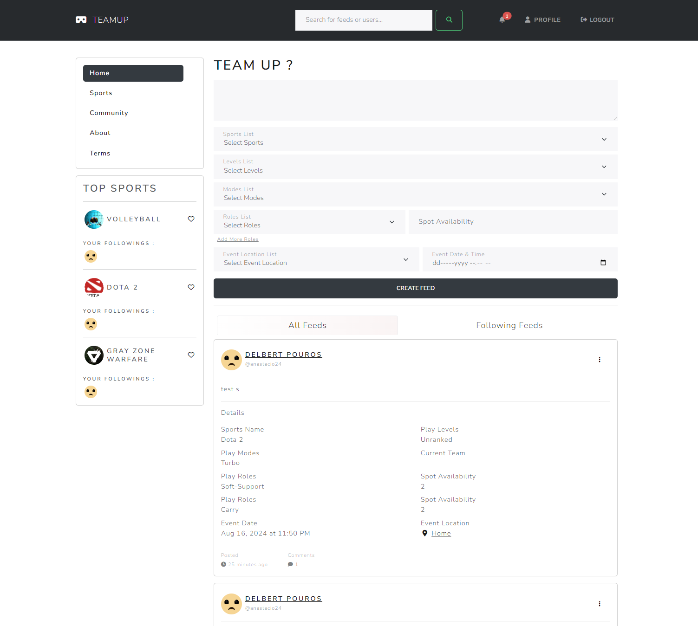

<p align="center">
  
</p>

<h1 align="center">
  TeamUp: Assemble your dream team in just one click
</h1>

<p align="center">
  <a href="" target="_blank"><strong>---Browse Website---</strong></a>
</p>

<p align="center">
  
  
  
  
  
  
  
  
  
</p>

## Table of Contents
- [Table of Contents](#table-of-contents)
- [General Info](#general-info)
- [Key Features](#key-features)
- [Getting Started](#getting-started)
- [How to Setup the webapps](#how-to-setup-the-webapps)
- [Next-features](#next-features)
- [Bug Known](#bug-known)

## General Info

TeamUp is a dynamic web application designed to simplify the process for gamers and sports enthusiasts to connect with others and form teams for their favorite activities. As a social media platform tailored specifically for the sports and gaming community, TeamUp enables users to post detailed feeds that outline all the necessary information for organizing meetups and gameplay sessions.

Whether you're looking to join a new game, organize a sports event, or simply connect with like-minded individuals, TeamUp offers a user-friendly and efficient solution to bring your gaming and sports experiences to the next level.

## Key Features

  1. User Feeds: Share and discover posts that include essential details like sport or game name, required roles, venue, and date.
   
  2. Team Formation: Easily find and team up with others who share your passion for sports or gaming.
   
  3. Detailed Listings: Each feed provides comprehensive information to help users find the perfect team or game session.
   
  4. Interactive Platform: Engage with other users through comments and follow-ups to ensure seamless coordination.

## Getting Started

## How to Setup the webapps

1. Clone the Repository
   <br>

    ```
        git clone https://github.com/mirzafahmi/TeamUp.git
    ```
2. Navigate to the Project Directory
   <br>
   
   ```
      cd TeamUp
   ```
3.  Install Dependencies
   <br>

   ```
      composer install
      npm install
   ```
   

1. Copy the .env.example file to a new .env file and update the environment variables.
   <br>

   ```
      cp .env.example .env
   ```

2. Generate Application Key
   <br>

   ```
      php artisan key:generate
   ```

3. Run Migrations and Seed the Database (Optional). You might encounter Unique constraint error when run FollowerSeeder and PreferredSportSeeder, but it is okay, just run again (still looking for fix).
   <br>

   ```
      php artisan migrate
      php artisan db:seed
      php artisan db:seed --class=FollowerSeeder
      php artisan db:seed --class=PreferredSportSeeder
   ```

4. Compile Front-End Assets
   <br>

   ```
      npm run dev
   ```

5. Start the Development Server
   <br>

   ```
      php artisan serve
   ```


## Next-features

1. Make group post of sports or community
2. Make retweet or repost functionality
3. Chat features
4. Convert auth to laravel breeze
5. Add Oauth with laravel passport
6. Do unit and feature testing
7. Decouple serve file into cdn/S3 bucket

## Bug Known

1. Follower and preferred sport seed as it caused unique constraint error
2. Sometimes, feeds able to be created even the roles are not included
3. Issue with concurent login of same user cause pdo error